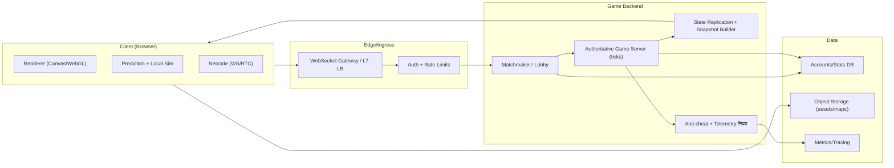
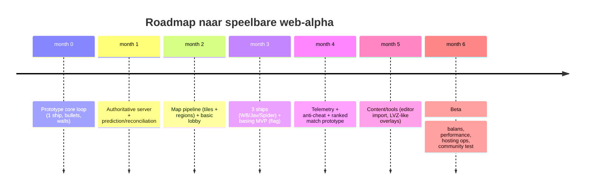

# Deep research: een webgame geïnspireerd door de klassieke Subspace/Continuum TrenchWars-server

## Executive summary

Deze studie beschrijft hoe je een moderne web-based game ontwerpt die mechanisch en competitief aanvoelt als de klassieke TrenchWars-ervaring, zonder de technische en juridische valkuilen van een “clone”. De kern van de spelbeleving komt voort uit (1) extreem leesbare, skill-based 2D combat met korte time-to-kill in sommige ship/arena-contexten, (2) een sterk team-objectief (flag/base control) met expliciete rolverdeling per schip, (3) powerup‑economy (“greens/bounty”) die micro-beslissingen afdwingt, en (4) server‑autoriteit met lage latency‑illusie via prediction/reconciliation en strikte cheat‑mitigatie. citeturn13view0turn12search0turn24search0turn24search14

Voor **ship-physics en wapendata** is er nu een relatief harde basis: een openbaar gedeelde set competitieve TW‑instellingen (in tabelvorm) met o.a. energie, recharge, afterburner drain, rotatie, (init/max) speed, thrust‑waarden, bullet‑kosten/snelheden/delays, en een set globale wapenparameters (bullet damage, bomb damage/radius, shrapnel, repel, rocket). citeturn35view0turn37view0 Die data dekt in deze vorm **6 van 8** klassieke schepen (WB/Jav/Spider/Terr/Lanc/Shark). Leviathan en Weasel ontbreken in de gepubliceerde tabel (waarschijnlijk omdat ze in sommige competitieve formats minder centraal staan), waardoor je voor die twee expliciet moet kiezen: (a) extra bronnen verzamelen (bijv. andere arena‑settings), of (b) waarden afleiden via instrumentatie/video‑analyse en ranges publiceren. citeturn35view0turn12search0turn36search3

Technisch is de aanbeveling: **authoritative server** (vast tick‑loop), client-side prediction + server reconciliation voor je eigen ship, entity interpolation voor anderen, en optioneel lag compensation voor hitscan/instant projectiles (of een simpeler model met “server is truth” en beperkte rewind). Dit sluit aan bij de gevestigde netcode‑praktijk (Valve/Source, Fiedler, Gambetta) en is essentieel om een snelle arena shooter in het web responsief te laten aanvoelen. citeturn24search0turn24search1turn24search14turn24search23

Juridisch is de belangrijkste conclusie: wil je risico beperken, dan moet je **inspiratie op mechaniek** strikt scheiden van **hergebruik van assets/merken/tekst**. In de EU is decompilatie voor interoperabiliteit beperkt toegestaan onder voorwaarden (o.a. noodzakelijkheid en beperking tot relevante delen). In de VS bestaan uitzonderingen/precedenten rond reverse engineering voor interoperabiliteit, maar DMCA‑anti‑circumventie kan alsnog risico’s geven. Dit vereist “clean room” discipline en eigen assets. citeturn27view3turn25search1turn25search5turn17view0

## Spelontwerp en metagame

De originele TrenchWars‑beleving is niet “één mode”, maar een cluster van elkaar versterkende spelvormen: duel‑formats, basing/flagging, en bot‑geautomatiseerde competitieve ladders.

**Kernmechanieken**
- **Energie als HP én resource**: energie bepaalt overleven, schieten en afterburners; als energie < 0 sterf je. Dit dwingt timing: schietvensters, disengage‑momenten en “energy management”. citeturn29search4turn36search8  
- **Afterburners als mobiliteits-‘commit’**: afterburners leveren pieksnelheid/acceleratie, maar trekken energie weg en beïnvloeden daarmee je “tank window” (hoeveel hits je nog kunt absorberen). In competitieve TW‑uitleg wordt afterburner drain expliciet als “drain per seconde” geïnterpreteerd die gedeeltelijk wordt gecompenseerd door recharge. citeturn37view0turn35view0  
- **Projectile-leesbaarheid**: bullets/bombs zijn snel maar duidelijk; bombs hebben blast radius; shrapnel creëert area denial en “random‑achtige” druk (al is bullet damage variance in de gepubliceerde competitieve set uitgeschakeld). citeturn35view0turn37view0  
- **Team control door objectives**: in basing wint niet wie de meeste kills heeft, maar wie het objectief het langst beheerst (flag/base). citeturn13view0  

**Match types (TrenchWars-ecosysteem)**
- **TWDD (Warbird 5v5)** en **TWJD (Javelin 5v5)**: elimination‑achtige structuur met death‑pool per speler en rounds met time limit; score beslist bij niet‑volledige eliminatie. citeturn13view0  
- **TWBD (Basing 8v8)**: doel is flag/base control over 15 minuten met lineup‑restricties (o.a. 1 terr, max 2 sharks, geen levis in dat format) en beperkte shipchanges. citeturn13view0  
- **TWSD (Spider flagging race)**: mobiele flagging waarbij attach/turret speed penalty geeft en flagger thrust penalty krijgt; kill‑scoring is asymmetrisch (flagger meer punten). citeturn13view0  
- In public arenas bestaan daarnaast (historisch) minigames als elim en duel‑arenas (wbd/javd/spidduel) die via arena‑navigatie te bezoeken zijn. citeturn18view0turn29search4  

**Scoring en ontwerpimplicaties**
- Basing‑formats laten zien dat je scoring twee lagen moet geven: (1) kills als tempo/druk, (2) objective control als echte win‑conditie. Dit voorkomt “deathmatch degeneratie” en forceert rollen als carrier/support en space‑control. citeturn13view0  
- In duel‑formats is het cruciaal dat je zichtbare “resource budget” (deaths per speler/round, time limit) spelers dwingt tot risicocalculatie, niet alleen aim. citeturn13view0  

**Powerups, bounty, progression**
- “Greens” (prizes/powerups) en “bounty” functioneren als een semi‑progressie: bounty correleert met “uitgerust zijn” en beïnvloedt sociale/competitieve dynamiek (wie je target, team‑greening, etc.). citeturn29search7turn28search0  
- In TW‑documentatie en community‑helpteksten worden powerups als multifire, shrapnel, antiwarp, mines, cloak/stealth, rockets, portals en bursters als arena/ship‑afhankelijk beschreven. citeturn12search0turn36search4  

**Map features**
- Continuum/TW maps zijn tile‑gebaseerd; een tile is 16×16 pixels. citeturn37view0turn20view0  
- De “pub” map heeft herkenbare zones (spawn/safe, open space, base/flagroom, choke points). In de TW‑newbie guide wordt expliciet verwezen naar het bekijken van de volledige map (Alt) en het bestaan van meerdere pub‑arenas afhankelijk van populatie. citeturn29search4turn29search0  

## Schepen en physics

### Datamodel en eenheidssysteem

In Subspace/Continuum‑serverecosystemen (o.a. ASSS) worden ship‑eigenschappen traditioneel als configuratieparameters uitgedrukt (energie/recharge, rotatie, max speed/thrust, weapon delays, etc.). De ASSS‑documentatie en community‑wiki’s specificeren dat deze waarden vaak in “honderdsten” of geschaalde eenheden staan (bijv. rotatie waar 400 ≈ volledige rotatie per seconde; delays in honderdsten). citeturn12search1turn28search3turn28search1  
Voor TrenchWars‑competitieve settings is er een expliciet gepubliceerde tabel met **conversieregels** (speed ≈ waarde/10 pixels/sec; bullet delay ≈ waarde/100 sec; enz.). citeturn37view0turn35view0

Belangrijk ontwerpdetail voor je webgame: **ship-physics is niet Newtoniaans “realistisch”**; het is een tuned arcade‑model met scherpe trade-offs. Daardoor kun je “mass” en “drag” het best behandelen als **afgeleide parameters** (zie “Afleiding als waarden ontbreken”). citeturn37view0turn28search1

### Exemplarische competitieve TrenchWars ship‑parameters (beschikbare harde data)

Onderstaande tabel is rechtstreeks gebaseerd op openbaar gedeelde competitieve TW‑instellingen (6 schepen) plus de globale weapon/misc‑parameters uit dezelfde bron. citeturn35view0turn37view0  
Voor **Leviathan** en **Weasel** ontbreken in die tabel expliciete numerieke waarden; daar geef ik ranges en meetmethoden.

**Vergelijkingstabel (raw config‑waarden + interpretatie)**  
_Notatie: E0=initial energy; R=recharge; AB=afterburner drain; Rot=rotatie; V0 init speed; Vmax max speed; T0/Tmax thrust; BulLv=bullet “level” veld; BulE=bullet energy; BulV=bullet speed; BulD=bullet delay; MF‑E/MF‑D multifire; BombE/BombV/BombT; MineE/MineD._ citeturn35view0turn37view0

| Ship | Rol (design) | E0 | R | AB | Rot | V0 | Vmax | T0 | Tmax | BulLv | BulE | BulV | BulD | MF‑E | MF‑D | BombE | BombV | BombT | MineE | MineD |
|---|---|---:|---:|---:|---:|---:|---:|---:|---:|---:|---:|---:|---:|---:|---:|---:|---:|---:|---:|---:|
| Warbird | duel/precision burst | 1500 | 4000 | 5500 | 200 | 2000 | 6000 | 16 | 24 | 3 | 450 | 500 | 100 | 450 | 100 | — | — | — | — | — |
| Javelin | bomber met rear gun | 1500 | 1500 | 5500 | 200 | 1900 | 6000 | 13 | 24 | 3 | 300 | -900 | 60 | 450 | 150 | 1100 | 2250 | 50 | — | — |
| Spider | basing DPS/suppress | 1400 | 2500 | 6200 | 180 | 1700 | 6000 | 18 | 24 | 3 | 225 | 400 | 35 | 225 | 35 | — | — | — | — | — |
| Terrier | carrier/support | 1500 | 1800 | 4000 | 300 | 4000 | 8500 | 24 | 24 | 1 | 400 | 800 | 75 | 500 | 75 | — | — | — | — | — |
| Lancaster | close-range shotgun | 1500 | 2500 | 4250 | 190 | 1800 | 6500 | 12 | 28 | 2 | 310 | 3650 | 45 | 435 | 50 | — | — | — | — | — |
| Shark | mine/EMP control | 1200 | 1500 | 4000 | 210 | 1875 | 6000 | 13 | 24 | — | — | — | — | — | — | 1150 | 1 | 0 | 200 | 10 |
| Leviathan | siege bomber (turret synergy) | *n.v.t.* | *n.v.t.* | *n.v.t.* | *range* | *range* | *range* | *range* | *range* | *range* | *range* | *range* | *range* | *range* | *range* | *range* | *range* | *range* | *range* | *range* |
| Weasel | stealth/assassin | *n.v.t.* | *n.v.t.* | *n.v.t.* | *range* | *range* | *range* | *range* | *range* | *range* | *range* | *range* | *range* | *range* | *range* | *range* | *range* | *range* | *range* | *range* |

**Globale weapon & misc‑parameters uit dezelfde competitieve set (essentieel om damage/cooldowns compleet te maken)**
- Bullet: base damage 520; damage upgrade 520; alive time 800; random damage = “No”; “adjust”=512. citeturn35view0turn37view0  
- Bomb: direct damage 2650; alive time 12000; explosion radius (pixels) 150; shrap damage 1500; shrap speed 6000; “inactive damage” 3; “adjust” 2048; EMP shutdown (max) 200. citeturn35view0turn37view0  
- Rocket: time 400; speed 3000. citeturn35view0turn37view0  
- Burst: speed 1200. citeturn35view0turn37view0  
- Repel: speed 1200; time 150; distance 150 (en in de TW‑uitleg wordt die radius opmerkelijk genoeg gelijkgesteld aan bomb radius). citeturn35view0turn37view0  

### Wapentypes en special abilities per ship (TrenchWars-specifieke rolkenmerken)

Naast raw stats moet je de **toegestane loadout** per ship expliciet modelleren. TrenchWars helpteksten benoemen o.a.:  
- Warbird: primair duel‑ship, bullets kunnen 1‑hit kill in relevante settings. citeturn36search4turn29search4  
- Javelin: bom die kan bouncen; zwakke rear bullets (bullet speed negatief is consistent met “rear gun” model). citeturn36search4turn35view0turn29search5  
- Spider: basing‑core; X‑Radar tegen cloakers; in sommige public settings kan Spider antiwarp krijgen (equip/buy afhankelijk). citeturn36search1turn12search0  
- Terrier: enige ship waarop je kunt attachen; “carrier” voor turrets. citeturn36search4turn13view0  
- Lancaster: wide-spread bullets (“shotgun”), in TW‑help expliciet als level 2 bullets benoemd. citeturn36search4turn36search1  
- Shark: mining ship met mines en EMP bombs. citeturn36search4turn35view0  
- Leviathan: long-range bomber met (historisch/typisch) zware bombs; in TW‑help expliciet “Level 3 bombs”. citeturn36search4turn12search0  
- Weasel: cloak/stealth identiteit; in TW‑help “enige ship met cloak én stealth” (met arena‑afhankelijkheden). citeturn36search4turn36search3  

### “Mass” en “drag/friction”: wat ontbreekt en hoe je het toch rigoureus maakt

**Waarom ontbreekt het vaak?** In klassieke Continuum‑settings is “mass” niet altijd een expliciet tunable parameter zoals in moderne rigid‑body engines; de gameplay draait om direct bestuurbare parameters (speed, thrust, rotation, energy, delays). citeturn12search1turn28search1  

**Aanpak voor een webgame (aanbevolen)**
1. **Normaliseer mass per ship** (bijv. mass=1) en behandel thrust als “acceleratie‑constante” in jouw eigen integrator (semi‑implicit Euler).  
2. **Introduceer expliciete linear damping (“drag”)** zodat coasting voorspelbaar is en clients makkelijk kunnen voorspellen (deterministisch).  
3. **Kalibreer damping** door (a) frame‑voor‑frame video‑analyse of (b) instrumentatie in je prototype: meet afremcurve van V(t) bij geen input.  
4. **Fit** een eenvoudige curve: `v(t+dt) = v(t) * (1 - k*dt)` (lineaire damping) of `v(t+dt)=v(t)*exp(-k*dt)` (exponentieel).  
5. Publiceer voor Levi/Weasel (en eventueel alle ships) je gemeten `k` en je integrator‑details; dit is belangrijk voor netwerk-reconciliation. citeturn24search14turn24search23  

### Leviathan en Weasel: ranges + meetmethoden als exacte waarden ontbreken

Omdat de publieke competitieve tabel (bron hierboven) Levi/Weasel niet toont, kun je toch een “exhaustive” set leveren door methodisch te meten en ranges transparant te publiceren:

**Meetmethode A: settings extractie via spelgedrag**
- Gebruik een gecontroleerde arena (privétest) en meet:  
  - **V0/Vmax**: laat ship constant thrust zonder afterburner (V0) en met afterburner (Vmax), lees Δpositie/Δtijd in pixels (map tile=16×16 px). citeturn37view0turn20view0  
  - **Rot**: draai 360° en time; in veel configuraties geldt 400 ≈ 360°/s. citeturn12search1turn28search1  
  - **Fire delays**: log keypress timestamps en server‑acknowledged shot events; of meet via video met frame counter.  
- Converteer met dezelfde interpretatieregels als in TW‑uitleg (speed≈/10 px/s; delays≈/100 s), maar valideer tegen observaties omdat community‑formules soms inconsistent worden weergegeven. citeturn37view0turn35view0  

**Meetmethode B: frame‑voor‑frame videoanalyse (als je geen server‑telemetrie hebt)**
- Neem 60/120fps footage op, exporteer frames, track ship center (pixel‑tracking) en differentieer naar snelheid/rotatie.  
- Voor projectiles: meet Δpositie per frame van bullets/bombs, corrigeer voor ship velocity (projectile speed in TW‑uitleg wordt “voor factoring in ship movement” beschreven). citeturn37view0turn29search5  

**Ranges (startpunt)**
- Weasel: verwacht relatief lagere energy pool dan basing‑core ships, maar met stealth/cloak‑mechaniek waarbij (in sommige pub‑changes) invisibility niet per se energie “drain” is, terwijl recharge onder invisibility wel wordt afgeremd. citeturn36search3turn36search4  
- Leviathan: verwacht lage mobiliteit solo (documentatie noemt “slow/poor recharge”), sterk afhankelijk van turret/terrier; er zijn historische wijzigingen geweest waarbij Levi sneller werd en EMP bombs kreeg, maar met lagere radius/damage dan voorheen (ten minste in “pub” wijzigingen). citeturn36search4turn36search3  

## Netcode en serverarchitectuur

### Autoritatief model en tick‑keuzes

Voor een snelle arena shooter is **server‑autoriteit** de standaard: de server simuleert de “ware” wereld, clients sturen input, en de server distribueert state snapshots. Valve beschrijft dit expliciet als client‑server met een dedicated, authoritative server. citeturn24search0  

De klassieke Subspace/Continuum‑stack laat zien dat zelfs oudere netcode sterk leunt op prioritering van weapon packets en adaptieve bandbreedtecontrole per speler. In ASSS wordt beschreven dat packets prioriteit krijgen (weapons vóór chat) en dat bandbreedte dynamisch wordt aangepast op basis van connection quality. citeturn19search13turn29search0  

**Praktische aanbeveling voor je webgame**
- Simuleer intern op **60 Hz** (of 100 Hz als je extreem strakke feel wilt), maar stuur snapshots naar clients op **20–30 Hz** met **interpolatiebuffer** (typisch 100–150 ms) voor remote entities. Dit sluit aan bij de algemene aanpak van entity interpolation bij fast-paced multiplayer. citeturn24search3turn24search23  
- Voor eigen ship: client prediction op input‑stream + server reconciliation op server‑acknowledged sequence numbers (klassiek uitgelegd door entity["people","Gabriel Gambetta","game networking writer"]). citeturn24search23turn24search7  
- Voor physics correctness en determinisme: houd je integrator identiek tussen client en server; beperk floating‑point verschillen (bijv. fixed‑point of quantization) om reconciliation jitter te verminderen. citeturn24search14turn24search0  

### Latency compensation en hit‑validatie

**Waarom nodig?** Zonder compensatie “schiet je achter het doel” bij hogere ping: de server ziet een latere wereld dan de client op het moment van input. Dit is het kernprobleem dat prediction, interpolation en lag compensation oplossen. citeturn24search23turn24search35turn24search1  

**Twee valide modellen voor een TrenchWars‑achtige shooter**
1. **Projectile-authenticiteit (aanrader voor TrenchWars feel)**  
   Behandel bullets/bombs als projectiles met lifetime en collision server-side; clients render predicted trajectories. Dit reduceert de noodzaak voor “rewind hit-scan”, maar vereist goede reconciliation en lag‑tolerante collision. citeturn24search14turn35view0  
2. **Server rewind (alleen voor instant/hitscan varianten)**  
   Valve beschrijft server-side rewind/lag compensation als het “rewinden van tijd” met behulp van latency bij het verwerken van een user command. citeturn24search1turn24search9  

### Cheat prevention, observability en schaalbaarheid

Een webgame met competitieve ambitie moet minimalistisch maar effectief verdedigen:
- **Input‑sanity**: throttle rate-of-fire server-side op basis van delays/cooldowns (bullet delay, mine delay, bomb delay) en energy checks. citeturn35view0turn28search3  
- **Anti-speed hacks**: server accepteert alleen beweging binnen physics envelope (Vmax, thrust, rot) en corrigeert afwijkingen; client-only hacks “foppen” in dat model vooral de hacker zelf. Dit is precies de security‑intuïtie achter authoritative physics + reconciliation. citeturn24search14turn24search0  
- **Lag‑meting**: ASSS meet latency o.a. via timestamps in position packets en RTT van reliable packet acknowledgements, met complicaties rond klok‑sync. Dit is een bruikbaar referentiepunt als ontwerpidee (ook al implementeer je het anders in web). citeturn29search0  
- **Interest management**: Continuum/ASSS‑settings tonen een pixel‑gebaseerde “send radius” voor bullets/weapons/positions. Dat concept (publish only nearby entities/projectiles) is cruciaal voor schaalbaarheid bij hoge player counts. citeturn15view3turn35view0  

### Referentie-architectuur (diagram)

## Webtechnologie en performance

### Rendering: Canvas 2D vs WebGL (en waar WebAssembly echt helpt)

**Canvas 2D**
- Sterk voor pixel‑art sprites, UI‑heavy HUDs, en snelle prototyping.  
- MDN geeft canvas‑performance tips zoals pre-rendering naar offscreen canvas om per frame draw calls te reduceren. citeturn22search31  

**WebGL**
- Sterk als je veel sprites/particles tegelijk moet tekenen (GPU batching), en als je shaders gebruikt voor glow/explosions.  
- OffscreenCanvas kan rendering naar een Worker verplaatsen (decorrelatie van DOM/main thread), wat nuttig is voor constante frame pacing. citeturn22search3turn22search15  

**WebAssembly**
WebAssembly is expliciet bedoeld als performante compile‑target voor C/C++/Rust, o.a. voor zwaardere use cases. citeturn22search1turn22search5  
In een TrenchWars‑achtige webgame is Wasm vooral zinvol voor:
- deterministische physics/netcode‑kern (shared tussen server en client),
- compressie/bitpacking van snapshots,
- path/region queries op maps (tile collision, ray checks).

### Networking: WebSockets vs WebRTC DataChannels

**WebSockets**
- Bidirectionele sessie browser↔server, breed ondersteund en operationeel simpel. citeturn22search16turn22search20  
- Je kunt binary frames als ArrayBuffer ontvangen via `binaryType="arraybuffer"`. citeturn22search0turn22search4  
- Nadeel: TCP head‑of‑line blocking kan jitter introduceren bij packet loss; je moet snapshot‑design daarop aanpassen (kleine packets, idempotent, drop‑tolerant).

**WebRTC DataChannels**
- DataChannels kunnen “unreliable/unordered” werken, wat conceptueel dichter bij UDP zit (geen garantie op delivery/ordering). citeturn22search34turn22search2  
- Nadeel: NAT traversal en connectiviteit is operationeel complexer (STUN/TURN), en debuggability is lastiger.

**Aanbevolen keuze voor een eerste productieroute**
- Start met **WebSockets** (simpeler infra, makkelijker observability).  
- Optimaliseer: delta‑snapshots, bitpacking, throttling, en robust interpolation buffers.  
- Overweeg WebRTC later als je heel lage latency wilt en je infra‑complexiteit kunt dragen.

### Physics engines: Matter.js, Planck.js, of custom

Voor TrenchWars‑achtige movement (top-down/side-ish, arcade, beperkte collision) is een full rigid‑body engine vaak “te veel” tenzij je sterk op fysische interacties inzet.

- Matter.js is een 2D rigid‑body engine in JavaScript. citeturn23search0turn23search4  
- Planck.js is een JS/TS rewrite van Box2D, gericht op 2D rigid bodies. citeturn23search1turn23search5  
- Rapier (Wasm) is cross‑platform en deterministisch per dezelfde versie/condities, wat aantrekkelijk is voor netcode. citeturn23search18turn23search6  

**Pragmatische aanbeveling**
- Gebruik **custom kinematics** + tile collision (AABB + swept collision) voor ships/projectiles; dit is makkelijker deterministisch te houden en eenvoudiger te reconciliëren. citeturn24search14turn37view0  
- Gebruik pas een engine wanneer je echte rigid-body interactie nodig hebt (pushable objects, physics puzzles).  

### Tech stack vergelijkingstabel (keuzehulp)

| Component | Optie | Voordelen | Nadelen | Wanneer kiezen |
|---|---|---|---|---|
| Rendering | Canvas 2D | Snel te bouwen; ideaal voor pixelart; eenvoudige tooling | CPU‑bound bij veel sprites | Prototype, low‑mid entity count, snelle iteratie citeturn22search31 |
| Rendering | WebGL | GPU batching; veel particles/sprites | Complexer; shader pipeline | Unlock “modern feel” met veel effecten; high player density citeturn22search15 |
| Threading | OffscreenCanvas + Worker | Minder main thread jank; stabielere fps | Niet overal identiek; complexere debugging | Als rendering/sim zwaar wordt citeturn22search3turn22search15 |
| Netcode | WebSockets | Eenvoudige infra; breed beschikbaar | TCP HoL bij loss | Default/aanrader voor launch citeturn22search16turn22search0 |
| Netcode | WebRTC DataChannel | UDP‑achtig (unreliable/unordered) | NAT traversal/TURN burden | Latency‑kritische regio’s of esports‑ambitie citeturn22search34turn22search2 |
| Kernlogica | JavaScript/TypeScript | Snel; één taal end‑to‑end | Determinisme lastiger bij floats | Klein team, snelle iterations |
| Kernlogica | WebAssembly (Rust/C++) | Performance; shared core; (potentieel) beter deterministisch | Tooling/interop overhead | Als je netcode/physics kern “hard” wilt maken citeturn22search1turn22search5 |

## Assets, tooling en modding

image_group{"layout":"carousel","aspect_ratio":"16:9","query":["SSCU Trench Wars public arena base map screenshot","Subspace Continuum ship warbird javelin spider terrier shark screenshot","Continuum LVZ map editor screenshot"],"num_per_query":1}

### Map-, sprite- en audio‑assets: wat bestaat er al in de community

De TrenchWars‑downloads bevatten grote verzamelingen: “Every TW Map” en “Every TW LVZ file (custom graphics)”, plus replacement graphics en sound packs. Dit is cruciaal als inspiratiebron voor workflow, maar niet automatisch herbruikbaar zonder licentie. citeturn18view0  

### Formaten en editors

- .lvl is de klassieke mapcontainer; map editors beschrijven levels als tiles + LVZ images (objecten die “vrij” in pixels op lagen kunnen liggen) en regio’s. citeturn20view0turn19search13  
- ASSS ondersteunt “extended lvl” met map attributes en “regions” (named tile sets met properties) die je server-side kunt gebruiken voor game logic, enter/exit events, no‑weapon zones, etc. citeturn19search13turn15view3  
- TWDev resources beschrijven o.a. dat LVZ data gecomprimeerd is en lokaal wordt opgeslagen in de zone‑directory na download; dat model (server pushes content, client caches) is direct relevant voor een webgame met mod‑workflows. citeturn19search5  
- Tools op de TW‑site: Drake’s editor, LVZ Tool Kit, tileset editor, en enorme map/LVZ dumps. citeturn18view0turn19search16  

### Aanbevolen “mod format” voor een web-remake (praktisch ontwerp)

Om de voordelen van het LVL/LVZ‑ecosysteem te behouden maar web‑vriendelijk te blijven:
- **Map**: JSON/CBOR met tile grid + layers + collision mask + “regions” als named sets (naar analogie van eLVL regions). citeturn19search13turn20view0  
- **Art**: spritesheets (PNG/WebP) + atlas metadata (JSON).  
- **Audio**: OGG/MP3 + event‑mapping.  
- **Server‑controlled overlays**: “LVZ‑achtig” object model: object id, layer, show/hide triggers, lifetime—geïnspireerd door LVZ object‑concepten in editors. citeturn20view0turn19search5  

## Juridische en licentie-aspecten

### IP-risico’s bij een “inspired by” project

TrenchWars/Continuum is een niche maar juridisch niet “vrij”: community‑sites vermelden expliciet dat SubSpace images auteursrechtelijk beschermd zijn (historisch gekoppeld aan de oorspronkelijke uitgever). citeturn17view0  
Conclusie: je moet ervan uitgaan dat:
- originele sprites/tiles/sounds/banners **niet** herbruikbaar zijn zonder expliciete toestemming/licentie;
- namen/branding (“Subspace”, “Continuum”, “TrenchWars”) mogelijk merk‑/trade dress‑risico’s geven als je ze product‑/marketingmatig kopieert.

**Aanbevolen praktijk (risk‑reductie)**
- Bouw **eigen assets** en eigen UI; gebruik alleen “mechanische inspiratie” (rollen, flow, arena‑structuur).  
- Houd documentatie bij van asset‑provenance en laat contributors akkoord gaan met een duidelijke content‑licentie (bijv. CC‑BY voor art of een Contributor License Agreement).  
- Vermijd dat je marketing “vervangt het originele spel” suggereert; positioneer als “arena shooter geïnspireerd door …”.

### Reverse engineering en interoperabiliteit

**EU (Software Directive 2009/24/EC)**  
De richtlijn maakt duidelijk dat:
- decompilatie zonder toestemming **alleen** mag wanneer reproductie/vertaling van code **onmisbaar** is om info te verkrijgen voor interoperabiliteit met een onafhankelijk programma, én onder voorwaarden (o.a. info niet “readily available”, beperken tot noodzakelijke delen). citeturn27view3turn26view0  
- daarnaast is “observe, study or test” van functioneren door een rechtmatige gebruiker toegestaan in de context van normaal gebruik (loading/running/etc.). citeturn27view3turn26view0  

**VS (fair use & anti-circumventie spanning)**  
- De EFF vat samen dat rechtbanken reverse engineering voor interoperabiliteit in sommige omstandigheden als fair use hebben gezien. citeturn25search1turn25search6  
- Tegelijk verbiedt DMCA 17 U.S.C. §1201 in algemene zin het omzeilen van “technological measures” die toegang controleren, met specifieke uitzonderingen/contexts. citeturn25search5  

**Praktische implicatie**
Als je doel primair “een webgame met dezelfde feel” is (geen interoperabiliteit met de originele client/server), dan is reverse engineering juridisch vaak minder verdedigbaar dan “clean-room re-implementatie” op basis van observatie en publiek beschikbare configuratieconcepten.

> Dit is geen juridisch advies; laat bij serieuze commercialisatie een jurist met software/IP ervaring meekijken.

## Implementatiestrategie en roadmap

### Milestones en teamrollen (realistische volgorde)

Een TrenchWars‑achtige webgame faalt meestal niet op “rendering”, maar op (a) netcode feel en (b) balans/telemetry. Daarom is de roadmap primair een netcode‑en‑playtest pipeline.

**Teamrollen (compact, maar compleet)**
- Netcode/engine dev (server tick loop, snapshot system, prediction).  
- Gameplay/system designer (ships, scoring, powerups).  
- Tools/content dev (map importer/editor, atlas pipeline).  
- Art/audio (eigen assets).  
- Ops/infra (deploy, observability, DDoS basics), plus community moderation.

### Testingplan (wat je expliciet moet meten)

- **Input-to-photon latency**: lokale client, 50ms, 150ms, 250ms RTT; meet “feel” bij spikes/jitter. (Gebruik Gambetta‑achtige demo‑principes: prediction vs none.) citeturn24search7turn24search23  
- **Desync rate**: aantal reconciliations per minuut en gemiddelde correctie‑afstand.  
- **Exploit tests**: rate-of-fire scripts, speed hacks (client spoof), packet flood.  
- **Balans‑telemetry**: kill distribution per ship/arena, objective control time vs kill ratio, powerup economy.

### Open-source vs proprietary keuzes

Een geloofwaardige strategie is “hybride”:
- Open-source: renderer, map tooling, replay viewer, basisprotocolbeschrijving (bouwt vertrouwen; helpt community).  
- Closed (of delayed open): anti-cheat heuristiek en exploit detection, tot je genoeg operationele zekerheid hebt.

### Hostingopties en kosten (schatting, prijzen als in bronnen)

Snel schalen vraagt meestal: 1–N game servers (regionaal), 1 matchmaker, 1 persistente DB, en object storage/CDN voor assets.

| Provider | “Klein” startpunt | Prijs-anker | Opmerking |
|---|---|---:|---|
| entity["company","Hetzner","hosting provider"] Cloud | CPX11 (klein compute‑node) | €5,99/maand (na prijsaanpassing) citeturn21search9 | Sterk prijs/kwaliteit in EU; geschikt voor 1–2 shards |
| entity["company","DigitalOcean","cloud provider"] Droplet | Basic droplet | vanaf $4/maand; per-second billing (v.a. 1 jan 2026) citeturn21search4turn21search0turn21search8 | Inclusief outbound transfer (afhankelijk plan) citeturn21search4 |
| entity["company","Amazon Web Services","cloud provider"] Lightsail | Containers (node) | $10/maand (Micro node, 1GB) citeturn21search2 | Handig voor matchmaker/webservices; game servers kunnen ook containerized |

**Schaalobservatie**
- TrenchWars‑achtige gameplay is bandbreedte‑gedreven door weapon/state updates; daarom is “interest management” (send radius, packet priority) belangrijker dan pure CPU bij middelgrote CCU. citeturn15view3turn19search13  

### Bronnenprioritering (wat dit ontwerp het meest “draagt”)

De meest “load‑bearing” bronnen voor dit rapport zijn:
- TrenchWars competitieve ship/misc settings + interpretatie (community archive) citeturn35view0turn37view0  
- TrenchWars match‑formats en basing objective‑model (TWD docs) citeturn13view0  
- Netcode best practices: authoritative server, prediction/reconciliation, interpolation, lag compensation (Valve, Gambetta, entity["people","Glenn Fiedler","game networking author"]) citeturn24search0turn24search1turn24search14turn24search23  
- ASSS serverdocumentatie als referentie voor configuratieconcepten (ship settings keys, net/lag control, extended LVL/regions) en TrenchWars community archives (/ssdl). citeturn12search1turn15view3turn19search13turn29search0  
- Web platform capabilities: WebSockets, OffscreenCanvas, WebRTC DataChannels, WebAssembly (MDN/WHATWG). citeturn22search16turn22search3turn22search34turn22search1turn22search20